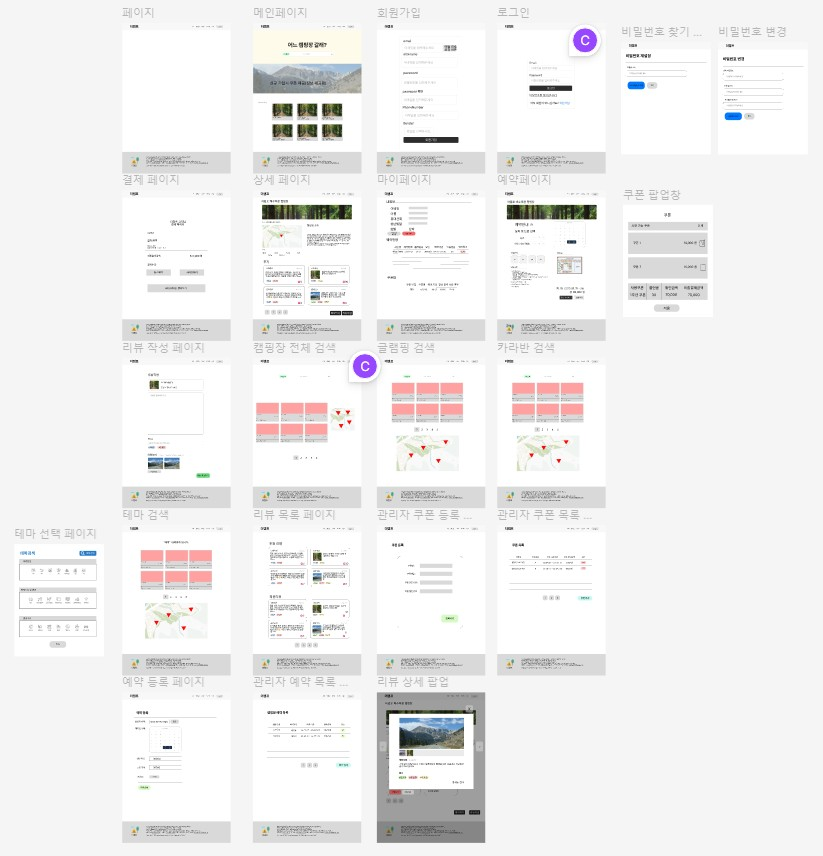

# 더캠프

### 주제
전국에 있는 캠핑사이트를 예약할 수 있게 해주는 사이트.

### 서비스 목표 
누구나 쉽게 예약하고 즐길 수 있는 캠핑서비스 제공.

## **기능 명세**

##### 1. 게스트 유저

##### 2. 일반 유저 
캠핑장 검색
- 지역별,캠핑장명별 키워드를 이용해 검색을 할 수있습니다.
 예약
 결제
 리뷰
 좋아요

##### 3. 관리자 유저
- 캠핑장 관리
    - 캠핑장의 zone을 추가,삭제 할 수 있다.
        - zone의 정보로는 zone이름,설명,가격,구획 수가 있다.
    - 캠핑장의 성수기,비수기,극성수기를 설정 할수 있습니다.
        - 기간이 겹치지 않도록 서버에서 확인후 insert를 하게됩니다.
        - 프론트와 백에서 시작날짜가 종료날짜 보다 크다면 예외가 발생합니다.
- 예약 관리
    - 관리자는 유저들의 예약정보를 관리 할 수 있습니다.
    - 예약 상태로는  RESERVATION_DONE,NO_CANCEL,USE_COMPLETE,CANCEL  이 있습니다.
    - 예약상태를 어드민이 변경할 수 있습니다.
- 쿠폰 관리
    - 관리자는 쿠폰을 생성,삭제 할 수 있습니다.
    - 쿠폰의 정보로는 쿠폰이름,쿠폰타입(일반유저,신규유저),할인률,만료기한이 있습니다.

## **상세기능**

##### 1. 회원 가입
이메일 인증방식
 pw
 pw확인
 닉네임
 생년월일
 연락처
 성별

##### 2. 로그인
이메일
 pw
 ㅡ비밀번호를 잊었을 시 이메일로 임시 비밀번호 전송

##### 3. 로그아웃

##### 4. 예약
비성수기 / 성수기 / 극성수기 별 차등요금
 1박 ~ 4박까지 가능
 최대인원 6인 (기본인원 성인 2, 소인 2 / 성인 1인 추가시 1만원 추가 요금)

##### 5. 리뷰
생성
 삭제
 리뷰 최신순 캠프사이트 정렬
 리뷰 좋아요순 캠프사이트 정렬렬

##### 6. 결제
카카오페이
 토스페이

##### 7. 좋아요
한 번 누를 시 좋아요 + 1
 좋아요 누른 상태에서 누를 시 - 1

##### 8. 쿠폰

## **기술스택**

 프론트엔드: React, Recoil, CSS
 백엔드: Spring boot, Spring security, Mysql, JWT
 배포: Nginx, GCP, AWS S3

## **역할분담**

## ERD

## Swagger
[Swagger](http://localhost:8080/swagger-ui/index.html)

## 와이어프레임

## 배포서버
[Server](34.64.252.205)

